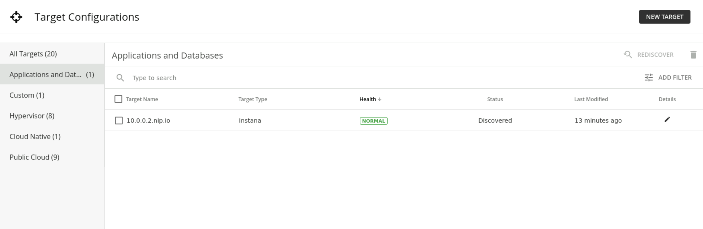

export const Title = () => (
  
    Add Instana Target  
  
)
;

## Adding Instana Target

Turbonomic supports the discovery of applications managed by APM tools - in this case, the Instana platform. Turbonomic includes the discovered information about these applications in its calculations for environmental health.

We have already prepared an Instana server for your environment. This server is monitoring two applications: RobotShop and Quote of the Day. In this section, you will go through the steps to add this Instana instance to your Turbonomic environment.

### Generate Instana API Token

1. To connect Instana to Turbonomic, you will need an API token from your Instana server so that Turbonomic can authenticate the connection. To generate this key navigate to your bastion VM and click on the Instana tab.

2. This will take you to the Instana login page. Log in using your Instana credentials. Instana credentials are provided in Turbo-PoT-Credentials tab.

3. Once you log in, click the gear icon on the left menu to open settings.

4. In the settings page, under "Team Settings", click on "API Tokens". Then click on "Add New Token".

5. Give your token a unique name like "api_YourInitials". Then scroll down and click on "Save". You can leave all other settings as default.

6. Now click on the eye icon to reveal your API token and take note of it. You will need this key in the next section. 

### Add Instana as a target

1. Navigate to your Turbonomic console on the bastion VM, then click "Settings" from the navigator.

2. Select the "Target Configuration" option. This will open up the page containing all configured targets.

3.  Click "New Target". This will open up a page with a list of available target types for this environment. 

**Tip:** This is not an extensive list of available target types. To view the full list and supported versions, visit the [documentation site](https://www.ibm.com/docs/en/tarm/8.8.0?topic=overview-turbonomic-targets).

4. From the list, select "Applications and Databases". Then select "Instana".

 

5. To add Instana, all you need is the hostname or IP address of your Instana server and an API token generated from your Instana backend. 
Uncheck "Validate Server Certificates". Once you have filled out this information, click "Add" at the bottom of the page. Since we don't have a proxy, we can leave those parts empty.

**Note**:** If the hostname and/or IP address is pre-populated as administrator and a password in this step, clear both and type in your information. 

**Tip:** Keep in mind, the hostname or IP address must be visible to Turbonomic. If you have your Instana and Turbonomic instances installed in different networks or the communication between them is blocked by a firewall, the target configuration will fail. 

6. Your newly added Instana target will appear in your list of targets. Check the "status" and "severity", it must show as "Discovered" and "Normal". Congratulations, you have successfully connected your Instana environment to Turbonomic.

Now that you have added a new target, allow 15 minutes for Turbonomic to run discovery and add the data from Instana. You can move on to the other labs in this time. To check this, look at your top business applications and look for two applications that will be added in from Instana: Quote of the Day, and RobotShop.

