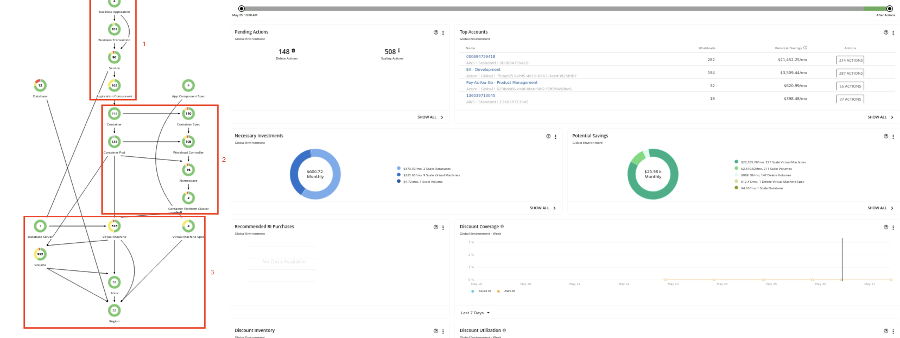
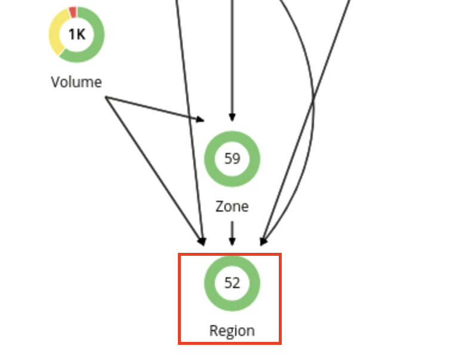
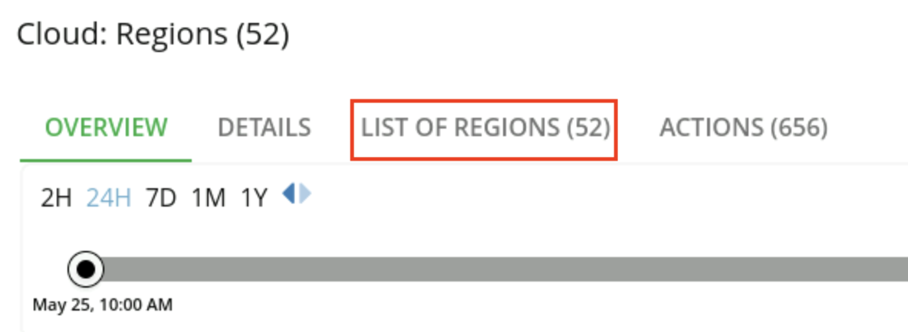
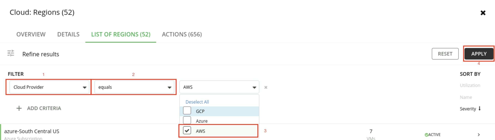
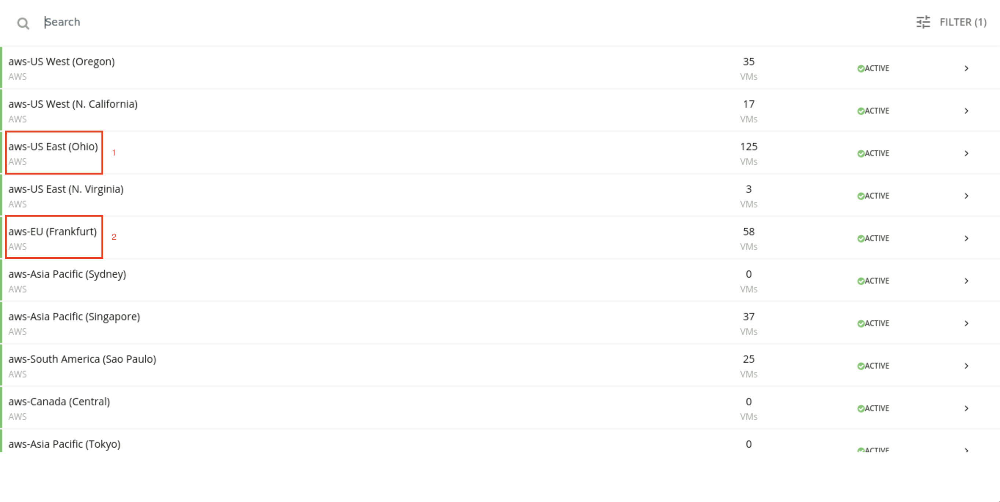

export const Title = () => (
  
    FinOps 1 - Visualizing your public cloud deployments  
  
)
;

## Get visibility into the cloud deployment
Before the bank can do any cost optimization, they must get a global view into their workloads. Turbonomic automatically creates a service graph that models the dynamic relationships of the workloads and their dependent infrastructure layers. This provides a full stack view from the application down to all the dependent cloud resources.

Let’s look at the cloud view, which combines all our accounts on public cloud providers (AWS, Azure, and GCP).

1. After logging in to the Turbonomic instance, select the CLOUD view and point out the types of entities, as highlighted in the screenshot and narration below.

There are three types of entities:

- Entities that represent the application workload (1)
- Entities that represent the container platform (2)
- Entities related to the cloud services (i.e., compute instances, storage volumes, Platform-as-a-Service (PaaS) services) (3)

Since the bank is dealing with the cloud, let’s start by examining the ‘Region’ entity. A Region is a logical grouping of physical data centers (Zones) that are in close geographic proximity. A ‘Region’ is comprised of one or more of these Zones. A ‘Zone’ represents an Availability Zone in your public cloud account or subscription. In the language of public clouds, a Zone is a data center.

The current view shows there are 52 Regions and 59 Availability Zones.

2. Select the Region entity.

 

Let’s get a high-level understanding of the geographic spread of the bank’s workloads across these regions.

3. Click LIST OF REGIONS. 

This dashboard lists out the various regions from the cloud providers (AWS, Azure, and GCP), along with the workloads running in a given region. Let’s take a look at the AWS workloads.

4. Click the FILTER icon. 

5. Set the filter to: Cloud Provider (1), equals (2), and AWS (3). Click APPLY (4). 

6. Point out the spread of the workloads across the various cloud regions, as highlighted in the screenshot and narration below. 

We can see the regional distribution of workloads, note that US East (1) and EU (2) have the most workloads. There are also several regions that contain no (or minimal) running workloads. This information is important because it can help the bank make decisions about consolidating workloads in a given region and purchasing pre-paid volume discounts, such as regional or zonal reserved instances (RIs), for maximum financial benefit.

7. Click X to exit the Cloud: Regions view. 

Now that we’re back in the default global cloud view, let’s examine the various summary dashboards.
