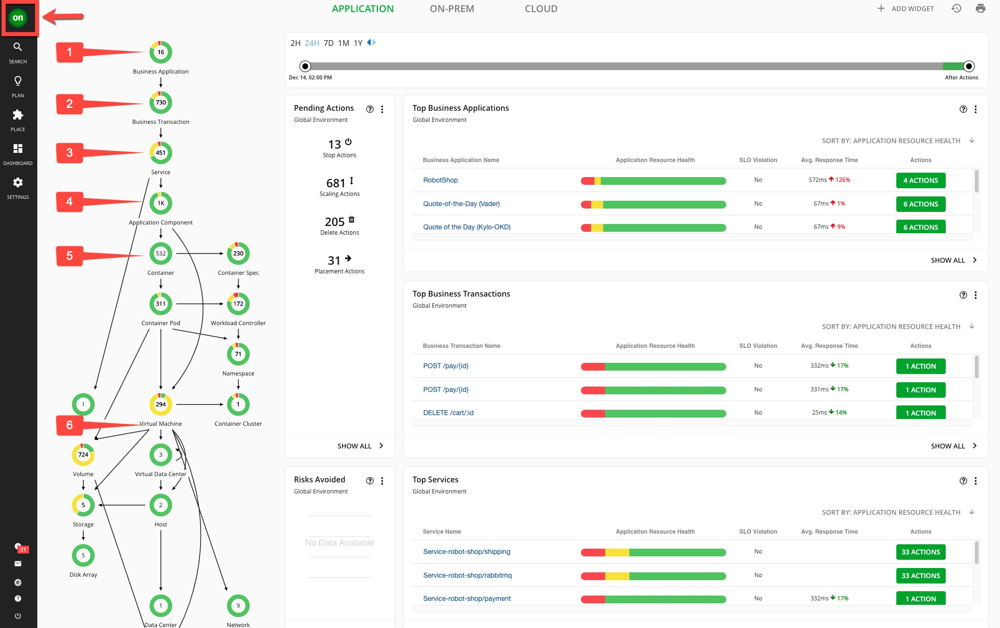
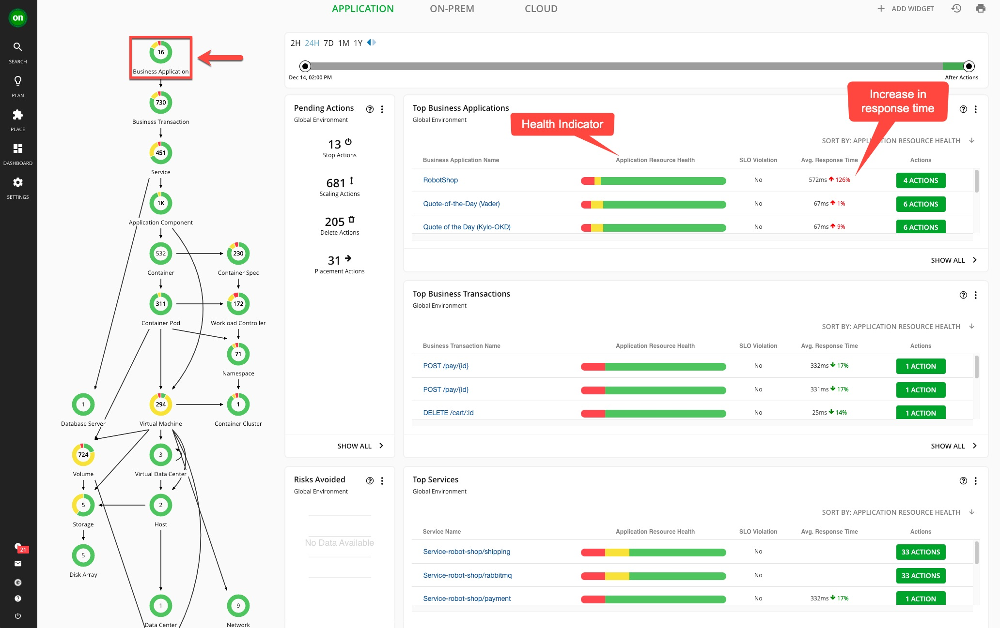
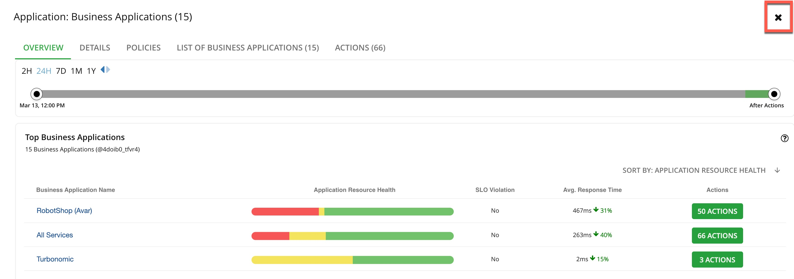

---
export const Title = () => (
  
    Lab 1 - Global view of the applications and their infrastructure dependencies  
  
);
---

## 1.1 - Examine the global supply chain
Turbonomic requires configuration and operational performance data to make resource optimization recommendations. The more data the better.

The RobotShop application is being observed by Instana. Turbonomic ingests data from Instana and builds a common data model to stitch together a graphical view of the application and its resource dependencies. In the Turbonomic nomenclature, this is called the “supply chain.”

The global supply chain models the dynamic relationship of the managed application and its dependent infrastructure layers.

#### Step 1.1.0
- Log in to the Turbonomic instance and click the On button in the upper left corner.
##### NOTE: The next six steps will refer to the graphic below.

#### Step 1.1.1

- Hover the cursor over the Business Application entity (1).
- The Business Applications entity shows the business applications of which Turbonomic is aware.

#### Step 1.1.2
- Hover the cursor over the Business Trans#### Step entity (2).
- The Business Trans#### Step entity shows logical business functions that an end-user would execute (such as a purchase or add-to-cart). Business applications are composed of these business transactions.

#### Step 1.1.3
- Hover the cursor over the Service entity (3).
- A service is basically a REST endpoint, and transactions use the services.

#### Step 1.1.4
- Hover the cursor over the Application Component entity (4).
- Services are hosted and executed in an application component, such as a Java virtual machine (JVM).

#### Step 1.1.5
- Hover the cursor over the Container entity (5).
- Application components run on a container platform like Kubernetes.

#### Step 1.1.6
- Hover the cursor over the Virtual Machine entity (6).
- Application platforms are hosted in virtualized environments like vSphere.

## 1.2 - Explore the top business applications view

Turbonomic displays the applications in order of risk.

In each of the entities, such as the Business Application entity, the colors that make up the circle reflect the current health of the entities. “Green” is healthy, “yellow” represents efficiency recommendations, and “red” represents performance recommendations..

#### Step 1.2.1
- Click the Business Application entity.

We see that there’s an increase in the average response time.
The current status indicates that there are some critical performance issues as well as some areas to improve efficiency.
The Actions button enables you to take the recommended actions directly from Turbonomic.

##### NOTE: We won’t click the Actions button at this time.

#### Step 1.2.2
- Click the X in the upper right corner to close the Application: Business Application page.

