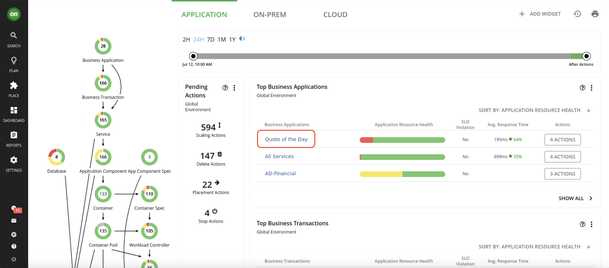
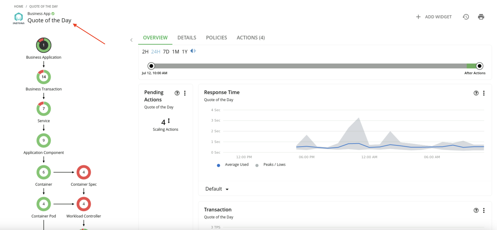
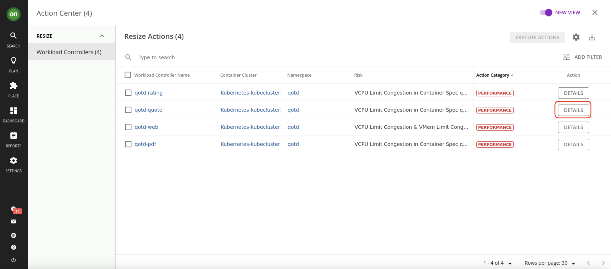

export const Title = () => (
  
    ARM 2 - Drilling into the Quote of the Day application  
  
)
;

Examine Quote of the Day resource dependencies
Now that we have a broad understanding of the global view, let’s examine the health of the Quote of the Day application. This is called “scoping.”

1. Click the Quote of the Day link to scope to Quote of the Day. *If Quote of the Day is not visible, click "Show All"

2. Point out that we are scoped to Quote of the Day, with data coming from Instana.

The supply chain can ingest data from a number of APM (Application Performance Monitoring) tools. In this case, the supply chain is scoped to Quote of the Day, and the charts provide a quick view of Quote of the Day’s overall operating health.

Since Quote of the Day is a Kubernetes-based cloud native application, all the entities in the supply chain are specific to a container infrastructure.

3. On the Pending Actions chart, click SHOW ALL.

The Turbonomic engine performs an ongoing (real-time) holistic analysis of the environment, generating resource optimization recommendations (and associated actions) that you can follow to resolve and avoid emerging problems.

Here we see container resize actions, categorized as ‘performance’ and ‘efficiency’ actions. These are displayed for you to either investigate further or execute manually.

Performance: Container resize UP actions are typically performance-centric actions that are driven to resolve an underlying resource congestion issue.

Efficiency: Container resize DOWN actions are typically efficiency-centric actions that are pointing to a resource optimization opportunity, likely a consequence of resource over- provisioning.

4. On the Action Center panel, under RESIZE, find the "qotd-quote" workload controller and select "DETAILS"

<InlineNotification>

If the "qotd-quote" controller does not have an action, expand the details of an action that does appear. If there are no actions, call over an instructor to assist.

</InlineNotification>

