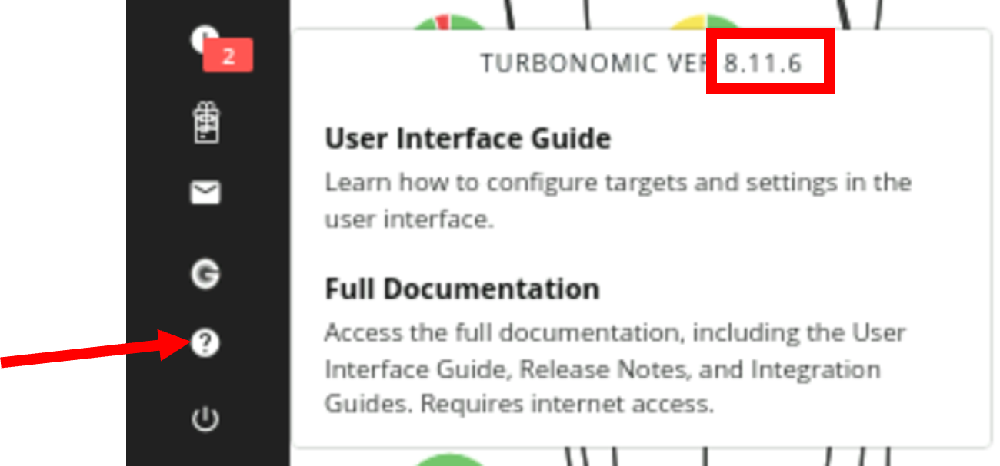

export const Title = () => (
  <span>
    Lab 2 - Add Kubernetes Target <br />
  </span>
)
;

## Adding Kubernetes Target

The Turbonomic platform gathers information from Kubernetes/OpenShift environment through **Kubeturbo** that is deployed into the Kubernetes/OpenShift cluster that you want to manage. Kubeturbo will run a single pod deployment with the following resources:

- Namespace or Project (default: turbo)
- Service Account
- Rolebinding defined
- ConfigMap which contains the connection to the Turbonomic server
- Deployment for Kubeturbo pod.


More information is available on the [Kubeturbo Wiki](https://github.com/turbonomic/kubeturbo/wiki). In this tutorial, you will be installing Kubeturbo via helm chart.

### Kubeturbo deployment via Helm charts

As per the requirements, for the KubeTurbo to communicate with the Turbonomic server, you need
* Turbonomic URL: https://10.0.0.1
* ServiceAccount: kubeserviceaccount (you will create this as described below)

### Create Service Account

The various steps to create a service account are:

- From your Turbonomic UI navigate to Settings -> User Management 

  

- Select **NEW LOCAL USER**  
  

- For the user details, please fill as
  - **USERNAME**: kubeserviceaccount
  - **PASSWORD**: CoC#Rulz! (as referenced in the "Turbo-PoT-Credentials")
  - **ROLE**: Site Administrator (default)
  - and then click **SAVE**  
  

- Validate the user is created  
  

### Install Kubeturbo on the Kubernetes cluster

The Kubeturbo is installed on the provided Kubernetes cluster. In this section, you will SSH into your Kubernetes cluster from your bastion VM. **So all commands will be executed from your bastion VM's Terminal window.**

- Find the Turbonomic Server Version from the console: The version here is **8.8.2**, as shown in the picture.  
  
  

- Open a Terminal window in your bastion VM. Navigate to "Activities" from the top left and click on Terminal.

- SSH to server kmaster (IPAddress: 10.0.0.3) using **user-id: cocuser**, **password: Refer to "Turbo-PoT-Credentials" on you bastion VM** and **ssh port: 2022**
  
  ```
  ssh -p 2022 cocuser@10.0.0.3
  ```

  To list all the helm releases in the cluster, execute the command below.
  ```
  helm ls -A 
  ```

  For example: to view the release for the Instana agent only, run this command
  ```
  helm ls -n instana-agent
  ```

  The result will be something like this:
   ```javascript
   NAME           NAMESPACE    	REVISION	UPDATED                                	STATUS  	CHART               	APP VERSION
   instana-agent instana-agent	1       	2023-03-20 23:33:01.070041691 -0400 EDT	deployed	instana-agent-1.2.56	1.244.0
    ```
 [Kubeturbo git](https://github.com/turbonomic/kubeturbo.git) is cloned locally. Then follow the steps:

  ```
  cd kubeturbo/deploy
  kubectl create ns turbo
  ```

  The result should be like this:
  ```
  namespace/turbo created
  cocuser@kmaster:~/kubeturbo/deploy$ 
  ```

 Next run the following install command to install kubeturbo:

<InlineNotification>

Copying this multi-line command and paste it directly to the Terminal will not work. Issues with mult-line formatting on the shell.

</InlineNotification>

 As a workaround do the following:
 - ** Copy the bellow multi-line command **
 - ** Open a Text Editor in the Bastion Server by dothing the following: **
 - . Select Activities
 - . Select Show Application (the 3x3 icon)
 - . Select Text Editor
 - ** Paste the "multi-line command" **
 - ** Copy it again and then paste into the Terminal Session **
  


  ```
  helm install  kubeturbo  ./kubeturbo --namespace turbo \
       --set serverMeta.turboServer=https://10.0.0.1 \
       --set serverMeta.version=8.8.2 --set image.tag=8.8.2 \
       --set restAPIConfig.opsManagerUserName=kubeserviceaccount \
       --set restAPIConfig.opsManagerPassword='CoC#Rulz!' \
       --set targetConfig.targetName=kubecluster1
  ```

  Will give output as:

  ```
  NAME: kubeturbo
  LAST DEPLOYED: Thu Mar 30 20:34:33 2023
  NAMESPACE: turbo
  STATUS: deployed
  REVISION: 1
  TEST SUITE: None
  ```

<InlineNotification>

**Tip**: 
The following commands may be handy, in case you run into issues and need to troubleshoot.  Do not use the below helm commands unless your helm install failed.  See the next set of kubectl commands for installation validation.

</InlineNotification>


## To remove helm release

```
helm delete kubeturbo -n turbo 
```
## To upgrade an existing release
```
helm upgrade  kubeturbo  ./kubeturbo --namespace turbo \
    --set serverMeta.turboServer=https://10.0.0.1 \
    --set serverMeta.version=8.8.2 --set image.tag=8.8.2 \
    --set restAPIConfig.opsManagerUserName=kubeserviceaccount \
    --set restAPIConfig.opsManagerPassword=myPassw0rd \
    --set targetConfig.targetName=kubecluster1
```
## To set the context for a namespace

```
kubectl config set-context --current --namespace=turbo
```

Check the logs to see if kubeturbo communicates with the Turbonomic Server.
  
  ```
  kubectl -n turbo get pods 
  ```

  The result will be like following:
  ```
  output
  ------
  NAME                         READY   STATUS    RESTARTS   AGE
  kubeturbo-5fb9df466d-l7lk4   1/1     Running   0          5m47s
  ```
  To check the logs for this pod take your pod's name from the output of the previous command and run the command below using your pod name.
  ```
  kubectl -n turbo logs -f kubeturbo-5fb9df466d-l7lk4
  ```

  The result will be a loop that keeps printing the logs for that pod, similar to the snippet below:

  ```
  snippet of output
  -----------------
  I0331 14:35:10.398686       1 kubeturbo_builder.go:519] ********** Start running Kubeturbo Service **********
  I0331 14:35:10.398736       1 mediation_container.go:67] Initializing mediation container .....
  I0331 14:35:10.398740       1 mediation_container.go:74] Registering 1 probes
  I0331 14:35:10.398769       1 client_websocket_transport.go:381] Trying websocket connection to: wss://10.0.0.1/vmturbo/remoteMediation
  I0331 14:35:10.407740       1 client_websocket_transport.go:384] Successfully connected to api service at: wss://10.0.0.1/vmturbo/remoteMediation
  I0331 14:35:10.407779       1 client_websocket_transport.go:305] Connected to server 10.0.0.1:443::192.168.1.219:40362
  I0331 14:35:10.407785       1 client_websocket_transport.go:306] WebSocket transport layer is ready.
  I0331 14:35:10.407799       1 remote_mediation_client.go:92] Start sdk client protocol ........
  I0331 14:35:10.407814       1 sdk_client_protocol.go:35] Starting protocol negotiation ....
  I0331 14:35:10.411017       1 sdk_client_protocol.go:118] Protocol negotiation result: ACCEPTED. Protocol version "8.8.2" is allowed to interact with server.
  ```
**Tip:** to break out of the logs loop you can do a ctrl+c.

- Now validate that the kubeturbo that is installed is showing up in the Turbonomic console. 
  - Go to Settings -> Target Configuration.
    
    

  - Click on **Cloud Native**
  - You will see the added kubernetes target with the name **Kubernetes-kubecluster1** (kubecluster1 is the name you specified during helm chart install).
  
    

- Now you can search for this cluster.
  

