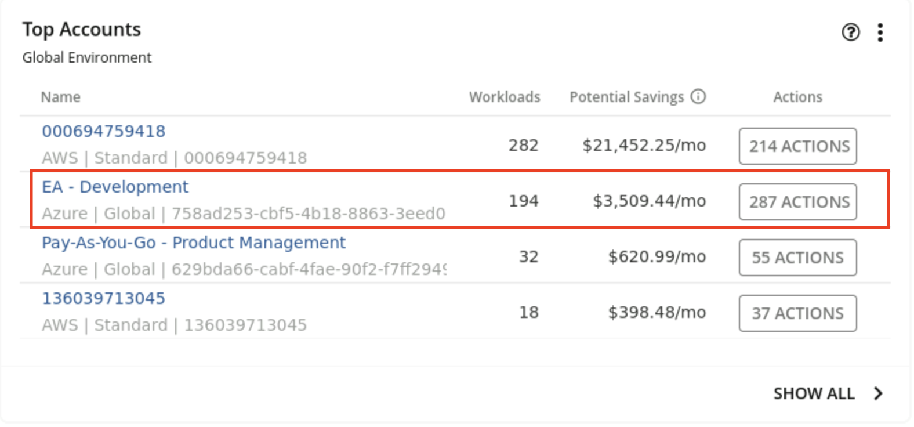
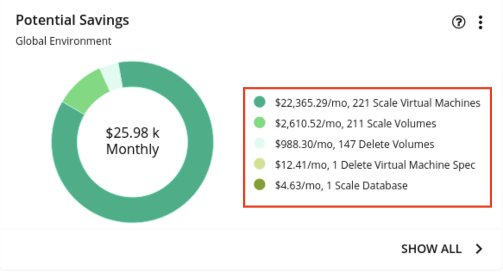

export const Title = () => (
  
    FinOps 2 - Getting recommendations for savings opportunities  
  
)
;

## Identify the highest spending accounts
Before the bank can make any cloud cost optimization decisions, they must understand several aspects of the cloud deployment. Turbonomic dynamically synthesizes a set of useful executive dashboards that help the bank better focus their cost optimization efforts. Doing this manually and continuously would be unscalable and inefficient.

Let’s take a look at some of these dashboards.

1. In the EA - Development row of the Top Accounts dashboard, point out the monthly Potential Savings.

<InlineNotification>
Since this is a live application, you may not see the exact same view (this caveat applies to the rest of the labs).
</InlineNotification>

The ‘Top Accounts’ dashboard lists the bank’s most utilized public cloud accounts and their monthly costs. Taking the recommended actions can result in a large potential savings ($3500/month in the case of this demo, but it could easily be substantially more). After data populates for an extended period of time, additional fields (Such as 30-day cost) will be populated for additional reference on savings. A consistent percentage of monthly savings (such as 10% of 30-day cost) can lead to massive savings for a large-scale cloud environment.

## Receive recommendations for potential savings opportunities

2. In the Potential Savings dashboard, point out the total monthly potential savings (inside the donut chart) and the breakdown list.

<InlineNotification>
The numbers may be small in this case, as this is a demo environment. The potential savings in a real customer environment are significant.
</InlineNotification>

The number inside the donut chart provides the bank an estimate of the total potential monthly savings. In the breakdown list on the right, we see that the bulk of these savings can be realized by righsizing/scaling virtual machines. Depending on the environment infrastructure and usage, savings could also include: buying reserved instances, rightsizing storage capacity, and eliminating waste.

Let’s take a closer look at each of these savings opportunities.
