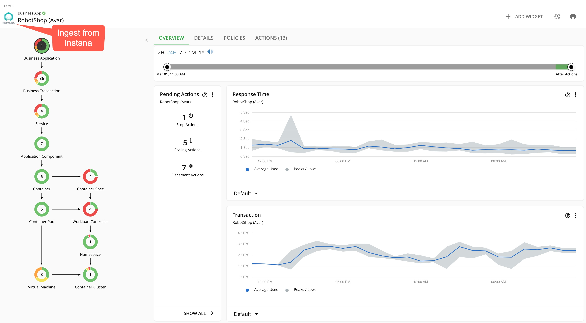
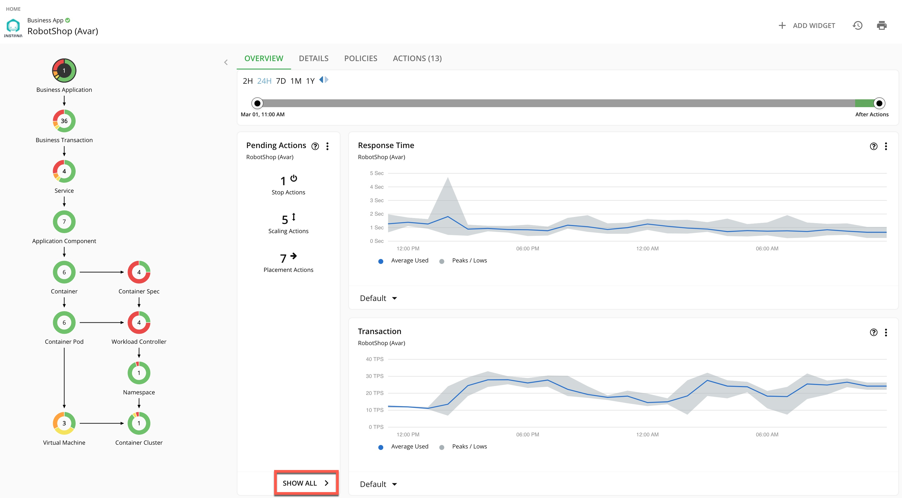
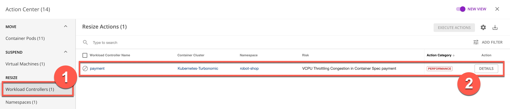

---
export const Title = () => (
  
    Lab 2 - Drilling into the RobotShop application  
  
);
---

## 2.1 - Examine RobotShop resource dependencies
Now that we have a broad understanding of the global view, let’s examine the health of the RobotShop application. This is called “scoping.”

#### Step 2.1.1
 - Click the RobotShop link to scope to RobotShop.

#### Step 2.1.2
 - Point out that we are scoped to RobotShop, with data coming from Instana.

The supply chain can ingest data from a number of APM (Application Performance Monitoring) tools. In this case, the supply chain is scoped to RobotShop, and the charts provide a quick view of RobotShop’s overall operating health.

Since RobotShop is a Kubernetes-based cloud native application, all the entities in the supply chain are specific to a container infrastructure.

#### Step 2.1.3
 - On the Pending Actions chart, click SHOW ALL.
 

The Turbonomic engine performs an ongoing (real-time) holistic analysis of the environment, generating resource optimization recommendations (and associated actions) that you can follow to resolve and avoid emerging problems.

Here we see container resize actions, categorized as ‘performance’ and ‘efficiency’ actions. These are displayed for you to either investigate further or execute manually.

Performance: Container resize UP actions are typically performance-centric actions that are driven to resolve an underlying resource congestion issue.

Efficiency: Container resize DOWN actions are typically efficiency-centric actions that are pointing to a resource optimization opportunity, likely a consequence of resource over- provisioning.

#### Step 2.1.4
 - On the Action Center panel, under RESIZE, select Workload Controllers (1). Then, click DETAILS (2) in the payment row.
 - NOTE: If there are multiple payment rows, select the first one.
 - NOTE: If the view does not match the screenshot below, click NEW VIEW at the upper right corner to enable the new view.

