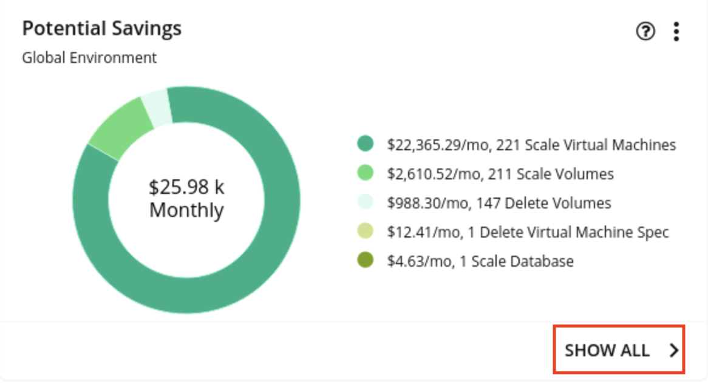
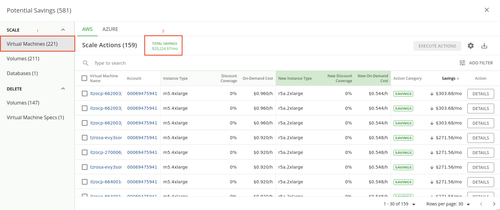
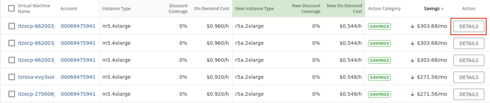
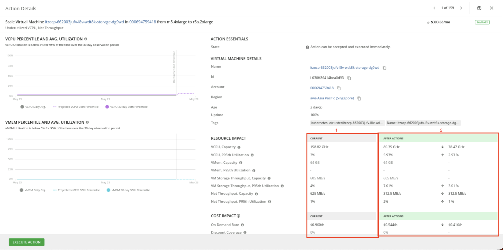
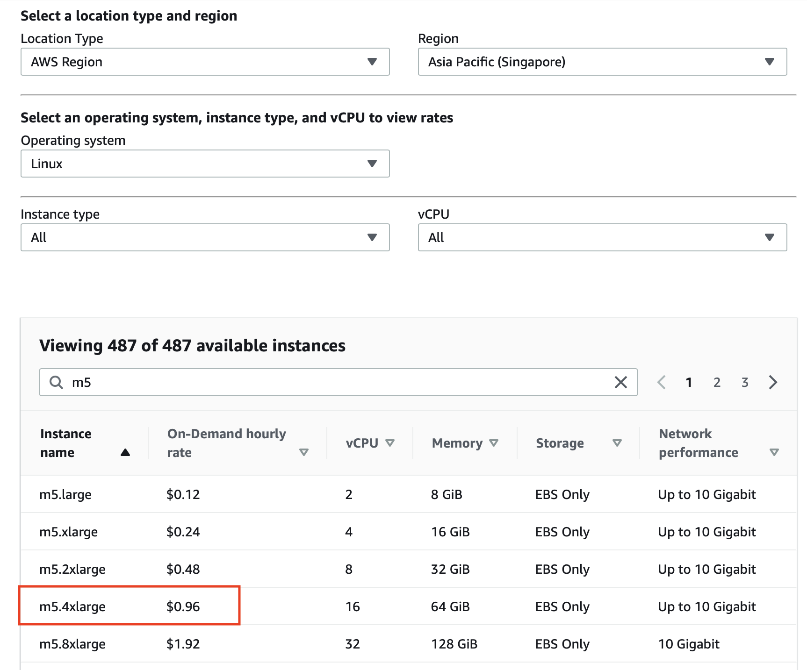
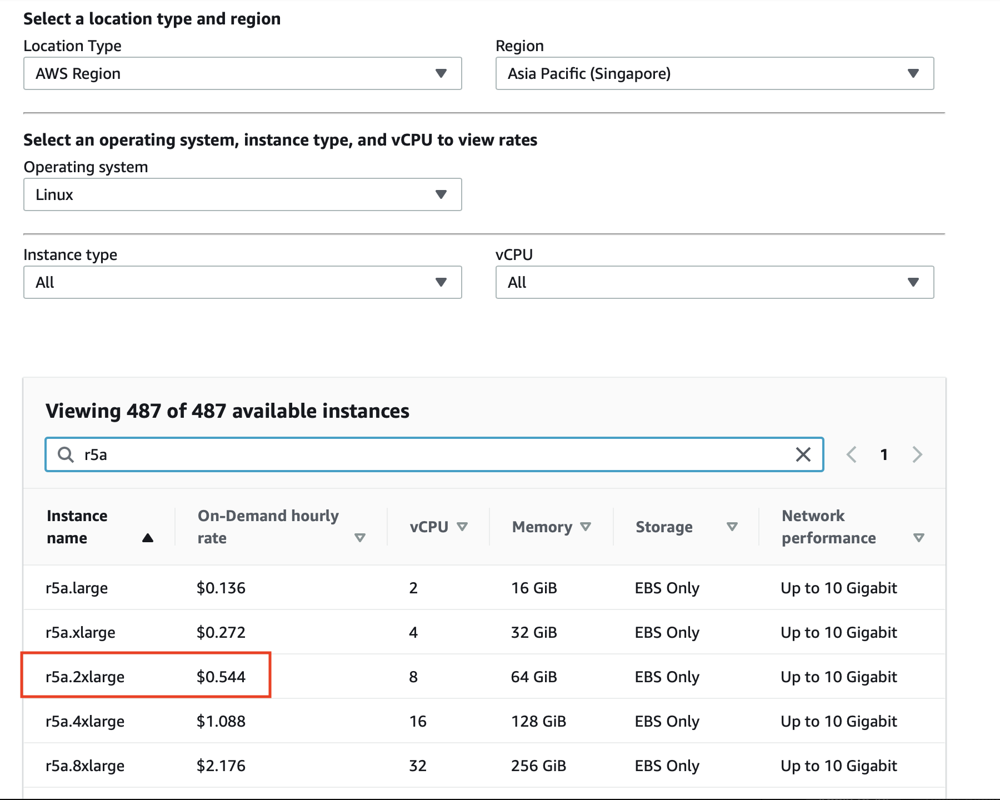
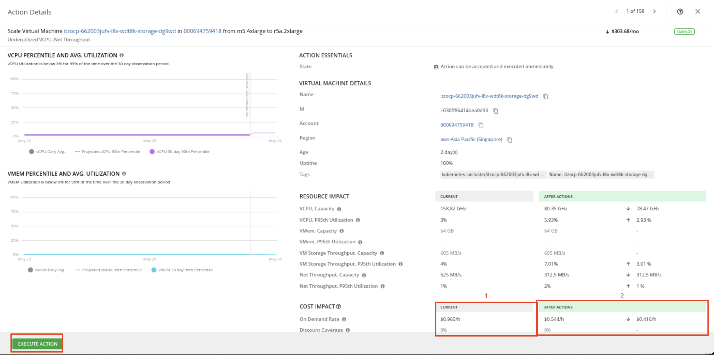
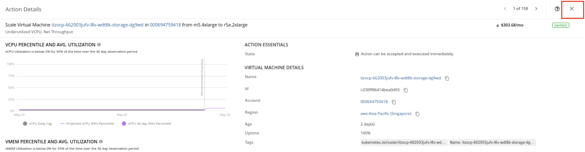

export const Title = () => (
  
    Lab 3 - Rightsizing compute instances
  
  
)
;

## Analyze a rightsizing recommendation
Compute resources are often the biggest line item on a cloud bill – they can total as much as 50% of the total bill. Hence, it makes sense that the bank starts their FinOps initiative by optimizing their compute resources.

In the language of Turbonomic, optimizing compute resources and scaling virtual machines mean the same thing. Lift-and-shift cloud migration strategies typically employ the legacy on-prem model of grossly oversizing their resources. The elastic scaling of the cloud, however, now enables the ability to continuously balance capacity and demand in real time, yielding higher cost efficiency.

Let’s start by exploring the potential savings that can be realized by scaling virtual machines.

1. Click SHOW ALL on the Potential Savings dashboard.

2. Select Virtual Machines under the SCALE category, and point out the details on the Potential Savings dashboard, as highlighted in the screenshot and narration below.

This dashboard categorizes the specific actions the bank can take to realize their potential savings. Note that the savings actions are classified into three categories:

- Scale: Identifies cost reductions that can be achieved by addressing overprovisioning of compute instances
- Delete: Provides recommendations to get rid of unattached storage (we’ll talk more about storage in the next section of this demo)
- Buy (not a visible option in this demo env): Recommends the purchase of highly discounted reserved instances to obtain significantly discounted pricing

In this view, the ‘Total Savings’ represents the cost reduction the bank can gain by accepting and executing all the recommended ‘Scale Virtual Machines’ actions.

Let’s examine the details behind the first virtual machine scaling action.

3. Click DETAILS on the first row.

4. Point out the Action Details

The current instance is highly underutilized (granted, the data polling is very brief since the demo environments are spun up recently). Turbonomic makes a recommendation to scale down to a different instance. If this action is taken, the instance utilization will increase. Making the recommended change will decrease the on-demand price and on-demand monthly cost. This would result in an approximate $0.416/hr (about $300/month, since this is instacne has 100% uptime) for this one instance. [Since this is a live application, your savings numbers and percentages may vary slightly.]

To understand how Turbonomic derived the on-demand price, on-demand monthly cost, and savings, let’s use Amazon’s AWS EC2 On-Demand Pricing Calculator.

5. Click [here](https://aws.amazon.com/ec2/pricing/on-demand/)
to be directed to Amazon’s AWS EC2 On-Demand Pricing Calculator (right click to open in a new tab). Fill out the On-Demand Plans for Amazon EC2 form with the following data:

 * Location Type: AWS Region
 * Region: Asia Pacific (Singapore)
 * Operating system: Linux
 * Instance type: All
 * vCPU: All
 * Search bar: m5

We can see that the current instance has an on-demand hourly rate of $0.960.

6. In the search bar of the On-Demand Plans for Amazon EC2 form, enter r5a.

We can see that the recommended instance has an on-demand hourly rate of $0.544.

7. Return to the Action Details panel.

<InlineNotification>
Since this is a shared demo environment, the VMEM PERCENTILE AND AVG. UTILIZATION graph on the right may not appear when you run the demo. Use the screenshot below to understand the analytics generated by the Turbonomic platform.
</InlineNotification>

Turbonomic has a direct integration with AWS to find the current on-demand rates and calculate cost savings. As we return to the Action Details panel, we can see that Turbonomic has already gathered the on-demand hourly rates for the current instance and the recommended instance for our convenience and ease of reference. As a result, the estimated on-demand monthly cost for the current instance is $691.20 per month (0.96/hr x 24hrs/day x 30days) and for the recommended instance is $391.68 per month (0.544/hr x 24hrs/day x 30days).

Based on this optimization, the bank can save approximately $300 per month, which is about 43% of the cost of the current instance. Note that the potential savings are on the on-demand price.

The ‘Execute Action’ button demonstrates the ability of the Turbonomic platform to execute the recommendations natively from the platform. This provides the IT Ops teams the convenience to act immediately and realize cost savings instantaneously. Moreover, it enhances operational efficiency by avoiding the need to jump between disparate tools and management consoles to implement a cost savings recommendation. Click "Execute Action".

8. Click X to close the Action Details panel.

Turbonomic continuously performs these cost optimization calculations in real time across large-scale deployments at CPU speed. Manual operator-driven optimization processes are time-consuming, do not scale, and can’t keep up with the dynamic rate of change.

Moreover, cloud service providers keep introducing new instance families to improve capabilities and price performance. The Turbonomic platform keeps abreast of these innovations and adds them to its analytics engine, providing the bank with updated recommendations based on the latest cloud offerings.

Let’s shift gears and look at storage cost optimization.
