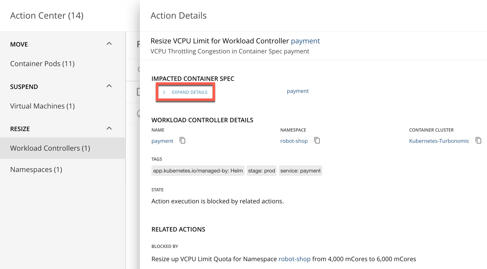
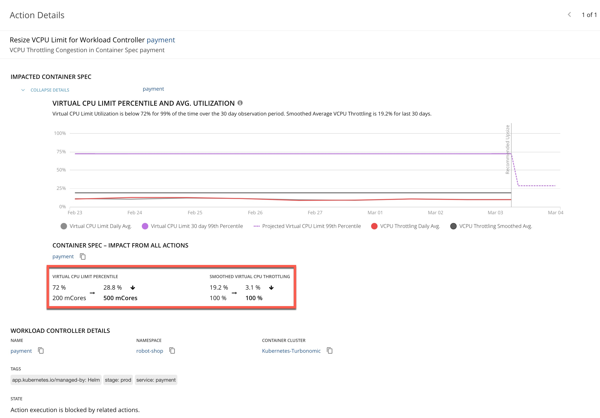
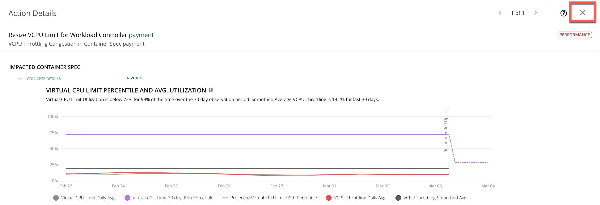
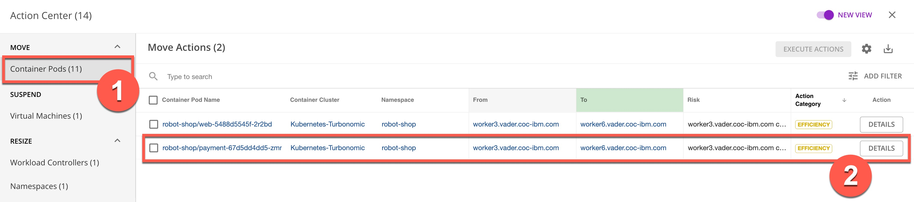
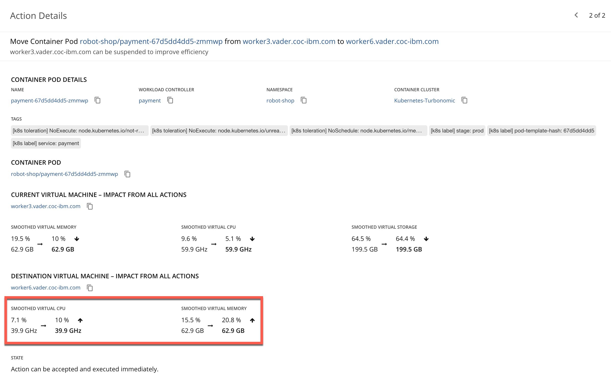
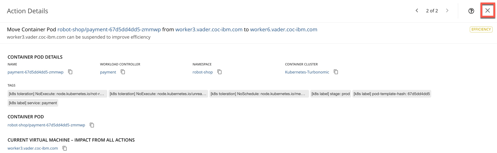
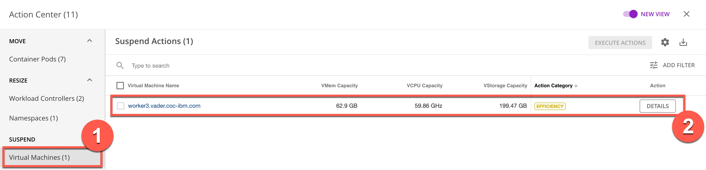
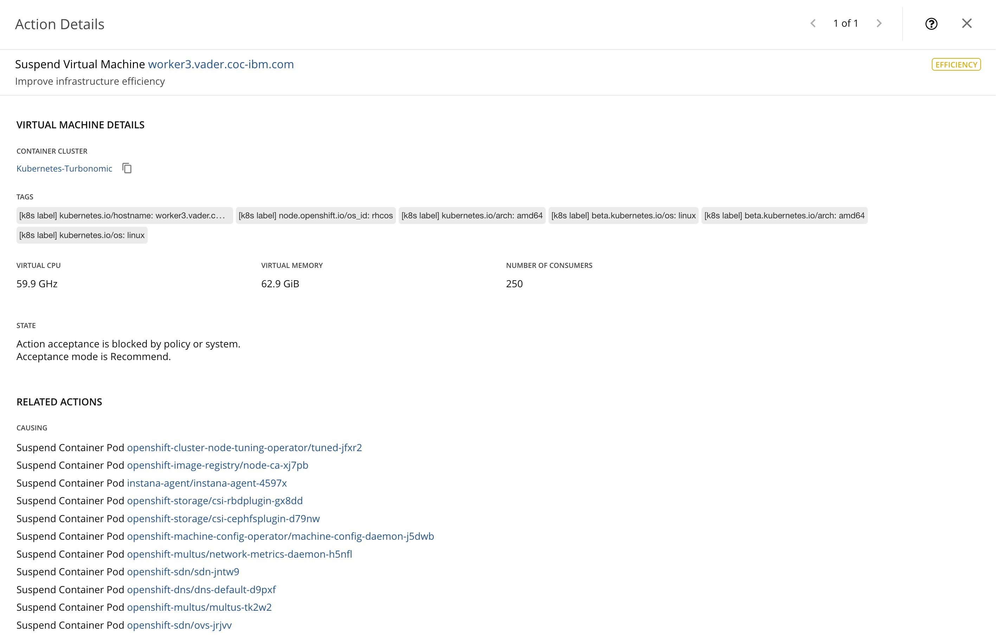

---
export const Title = () => (
  
    Lab 3 - Performance Recommendations  
  
);
---

## 3.1 - Analyze a container right-sizing performance recommendation

Let’s explore one of the performance recommendations in more detail.

#### Step 3.1.1
 - On the Action Details page, if the details are not already expanded, click Expand Details.

#### Step 3.1.2
 - Review the performance action details. Point out the recommendation to upsize the virtual CPU limit from 200 mCores to 500 mCores.
 - NOTE: Since this is a dynamic system, the metrics displayed on your screen may not necessarily reflect the exact numbers in the screenshot.

 
CPU throttling directly impacts the response time of a service and therefore user experience. Turbonomic observes and tracks CPU throttling. In the case of RobotShop, the response time latency of the payment service can adversely impact the ecommerce checkout experience.
Given the rate of throttling being observed, Turbonomic recommends increasing the CPU limit from 200 mCores to 500 mCores, thereby reducing the CPU throttling from 19.2% to 3.1%.
Proactively alleviating CPU congestion pressures by providing these analytics-driven recommendations helps keep the application in the desired state where it meets its defined service-level objectives (SLOs).

#### Step 3.1.3
 - Click the X in the upper right corner to close the Action Details page.

## 3.2 - Analyze a proactive workload redistribution recommendation

The underlying cloud native environment to which the RobotShop microservices are deployed is highly dynamic.

The initial node to which a pod was placed may not always remain the most optimal place to continue executing this workload. An unhealthy application can cause cascading issues, potentially impacting healthy neighboring pods. Additional node capacity may present alternative optimal placement options that were not available at the time when this pod was initially placed.

Continuously and proactively redistributing workloads, in line with shifting load patterns and available capacity, helps assure application performance and infrastructure operational efficiency.

#### Step 3.2.1
 - On the Action Center panel, under MOVE, select Container Pods (1). Then, click DETAILS (2) in the robot-shop/payment row.
 - NOTE: If there are multiple robot-shop/payment rows, select the first one.

#### Step 3.2.2
 - Review the efficiency action details. Point out the recommendation to relocate the payment pod from where it is currently running on worker node 3 to worker node 6.
 - NOTE: Since this is a dynamic system, the metrics displayed on your screen may not necessarily reflect the exact numbers in the screenshot.

 
If the underlying node is getting congested, it will attempt to identify an alternate node with more capacity. If, on the other hand, as is the case here, the underlying node is underutilized, it makes sense to proactively redistribute the workload to other appropriate nodes to improve operational efficiency.

The Turbonomic analysis engine computes the current and possible future state of the cluster if the Move action is accepted for execution. As we can observe here, the migration of workloads from worker node 3 to worker node 6 will result in a marginal increase of virtual CPU utilization from 7.1% to 10% and an increase of virtual memory consumption from 15.5% to 20.8% of worker node 6.

Continuous redistribution of workloads helps better optimize overall cluster resources in terms of performance and cost of ownership.

#### Step 3.2.3
 - Click the X in the upper right corner to close the Action Details page.

## 3.3 - Analyze an intelligent cluster scaling recommendation

The Turbonomic analysis engine is continuously exploring opportunities to optimize overall cluster efficiency, essentially balancing cluster capacity with workload demand.

Pods consume resources from the underlying nodes on which they are placed. Nodes are represented as virtual machines (VMs) in the supply chain. When pods begin experiencing performance issues due to diminishing resources at the underlying node level, Turbonomic will provide early recommendations to provision additional cluster capacity.

On the other hand, it will seek out opportunities to consolidate workloads on a fewer number of nodes, thereby driving down operational costs.

#### Step 3.3.1
 - On the Action Center panel, under SUSPEND, select Virtual Machines (1). Then, click DETAILS (2) in the vader.coc-ibm.com row.

#### Step 3.3.2
 - Review the action details.

Executing the Suspend action will result in reclaiming and possibly repurposing the compute resources of worker node 3.

These actions enhance overall cluster operational efficiency and naturally yield significant costs savings, while not compromising application performance and availability.

#### Step 3.3.3
 - Click the X in the upper right corner to close the Action Details page.