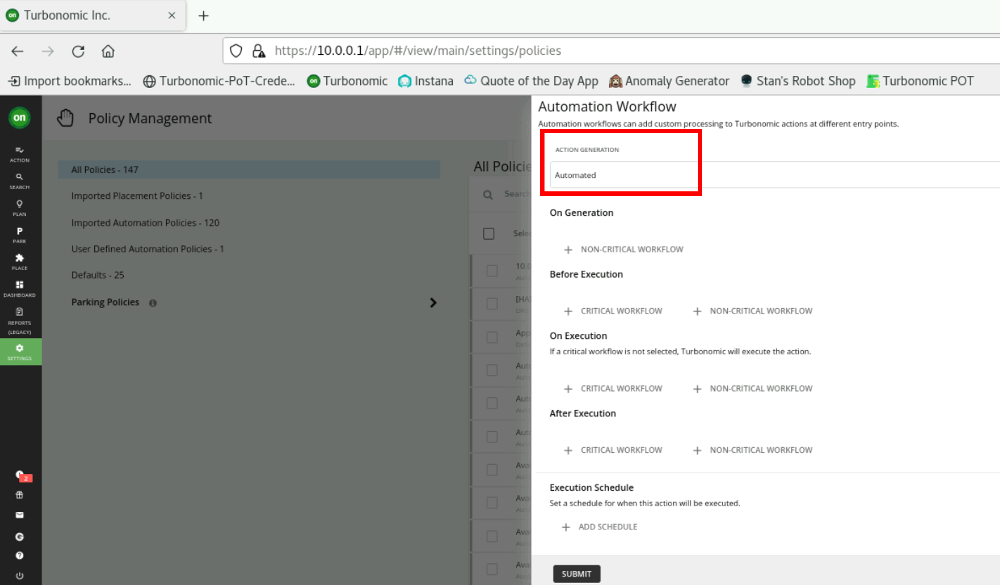

export const Title = () => (
  
    Lab 4 - Automating Actions  
  
)
;

## What are policies in Turbonomic?

Policies set business rules to control how Turbonomic analyzes resource allocation, how it displays resource status, and how it recommends or executes actions. Turbonomic includes two fundamental types of policies:
### •	Placement Policies
To optimize your environment, Turbonomic recommends actions to place workloads such as applications, containers, or VMs on their providers. Turbonomic can recommend these actions or execute them automatically.
### •	Automation Policies
As Turbonomic gathers metrics, it compares the metric values against specified constraints and capacity settings to determine whether a metric exhibits a problem and what actions to recommend or execute to avoid a problem. Turbonomic uses Automation Policies to guide its analysis and resulting actions.

## Lab - Explore existing policies

### As a reminder, please ensure that you are logged in with an Administrator user. If you haven't logged out of your demo users, you will not have the necessary permissions to run through the labs.

1. Navigate to "Settings", then "Policies". In this page, you will see a list of all existing policies.

2. From the list to the left, select "Defaults". This will show a list of all system default policies. 

**Tip:** These default policies remain effective unless a user creates a policy affecting the same resources but with different criteria. User-defined policy overrides the default policy.

3. Scroll down in default policy list and click on "Storage Defaults". Now notice that this policy sets the "Resize" action acceptance set to recommend. This will result in all resize actions generated for storage to be set to recommend only and be unable to execute within Turbonomic. 

4. Navigate to "Virtual Machine Defaults" policy from the default policies list. You can see that all cloud scaling actions are set to "Manual" which allows them to be accepted and executed (assuming there are no prerequisits for them).

## Lab - Create an Automation Policy
In this lab, you will create an automation policy to define how you'd like Turbonomic to treat actions as they appear. Keep in mind, user-defined policies will override system default policies that affect the same entity.

### Scale Cloud Volume

In this section you will create an automation policy to automate scaling of cloud volume actions. Let's automate volumes whose scaling actions are non-disruptive, reversible and offer cost savings (because they offer the lowest risk and highest reward).

1. Navigate to "Policies" from "Settings". Then click on "New Automation Policy" on the top right side of the window. Select "Volumes" from the list.

2. Because our focus is scaling cloud volumes, select cloud from the list on the left, then select "akachkaev-test-action_group" form the list and click on the submit button.

3. This will open up the "Configure Volume Policy" page. 

    

    1- Give your policy a unique name like "cloud_scale_YourInitials". 
    
    2- Notice how the scope is set to the group of volumes you selected. 
    
    3- We want this policy to be effective always and immediately so we will leave the "Policy Schedule" empty.
   
    4- Toggle the "Volume Scaling Actions" on to enable these actions.
   
    5- Since we want to automate the lowest risk actions, use the pencil icon next to "Non-Disrubtive Revesible Scaling" to edit the "Action Acceptance" and set it to "Automatic". Leave the Orchestration settings as default. click on "Submit" to go back to the policy editor.

    

    6- Scroll down and ensure "Disruptive Reversible Scaling" is set to "manual" since you'd like to plan for the downtime resulting from this action before taking it.
    
    7- Set "Disruptive Irreversible Scaling" to "Recommend". 
   
    8- Since our goal is to maximize savings, choose that option.
    
    9- Allow generation of "Volume Deletion Actions" by toggling it to green and set its action acceptance to "Manual". 

    

    10- Scroll further down until you see a graph of and its settings below it. They are set to defaults in Turbonomic but if you wanted to change that this section is where you do it for the specified group of resources. The chart in this page will show the effect of changing each setting.
        - **Aggressiveness** - Defines what is the percentile you want the utilization of the resource to be before taking and action. Leave it at P95 for this lab.
        - **Min Observation Period** - This Lets Turbonomic know what the shortest amount of time is it needs to monitor a resource before generating actions to optimize it. Leave this setting as "None".
        - **Max Observation Period** - This settings tells Turbonomic how long we want it to monitor the resource before generating an action. Leave this setting as "30 days".
    
    11- You can leave the rest of the settings in the policy editor as is and then click on "Save and Apply". If a window pops up, click "Apply".

    

    
