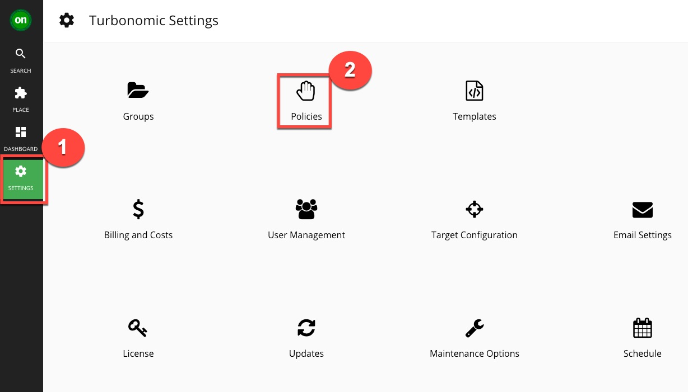
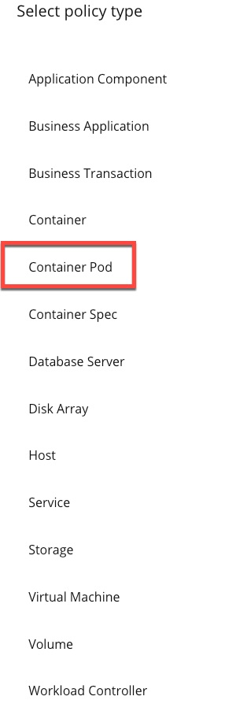
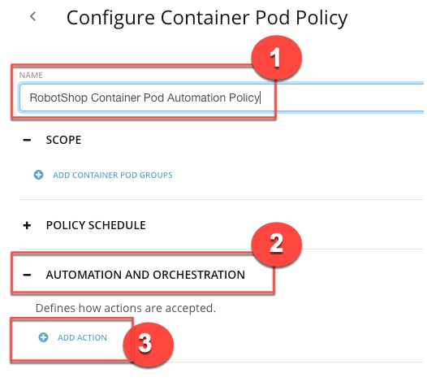
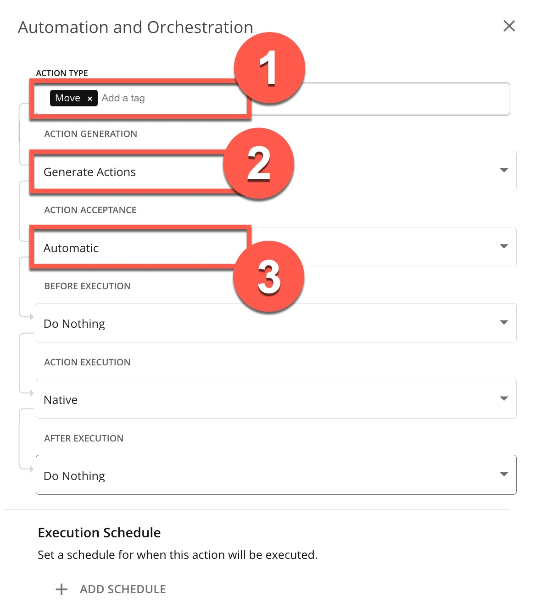

---
export const Title = () => (
  
    Lab 4 - Automating Actions  
  
);
---

## 4.1 - Automate the execution of actions

Though Turbonomic allows you to initiate an action natively from the platform with the click of a button, it is a best practice to automate the execution of these actions.

We will now define a policy that enables you to automate the platform-derived actions without having to jump into multiple tools. This significantly enhances operator productivity.

#### Step 4.1.1
 - Log out and log back in using the following credentials:
 - Username: cocadmin
 - Password: CoC#Rulz!

#### Step 4.1.2
 - Click SETTINGS (1) and select Policies (2).

#### Step 4.1.3
 - Click NEW AUTOMATION POLICY.
 - NOTE: If you do not see the NEW AUTOMATION POLICY button, it means that the system is currently running in a restricted read-only mode. In this case, skip Actions 4.1.4-4.1.6 and proceed to the .
 - NOTE: Actions 4.1.4-4.1.6 represent how an automation policy can be configured and put into effect.

 
#### Step 4.1.4
 - Select Container Pod.

#### Step 4.1.5
 - Give the policy a custom NAME. Then, expand AUTOMATION AND ORCHESTRATION (2) and click ADD ACTION (3) to define how an action is accepted

 
#### Step 4.1.6
 - Fill out the Automation and Orchestration panel:
 - Set ACTION TYPE to Move (1).
 - Set ACTION GENERATION to Generate Actions (2).
 - Set ACTION ACCEPTANCE to Automatic (3).
 - IMPORTANT NOTE: Do NOT click Submit, as this is a read-only environment.

Once the automation policy is saved, it will go into effect. All configured actions will now be executed automatically.

The main benefit and best practice of Turbonomic is to execute the platform-derived actions automatically. The underlying goal is to reduce or remove human intervention and leverage automation to maintain application performance and improve operational efficiency.

Although we have demonstrated how actions can be initiated automatically from Turbonomic, typically IT organizations manually execute actions until they are confident that the actions are trustworthy. As the organization’s level of comfort matures over time, actions are executed in an increasingly automated fashion.