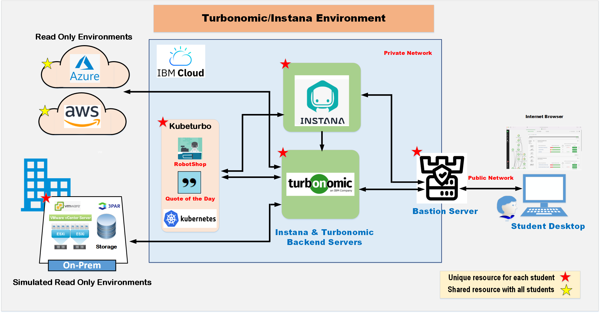
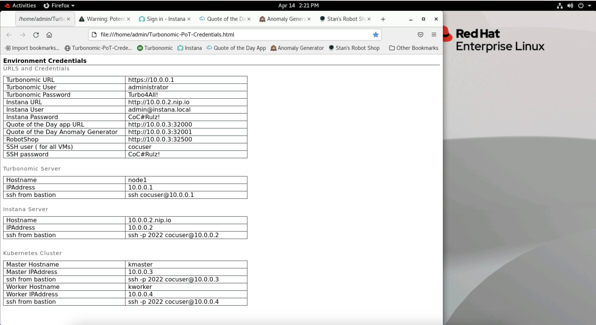

export const Title = () => (
  
    Lab Environment  
  
)
;

## Architecture
Below is a high-level view of your environment's architecture.

# Your lab environment
To go through your lab sessions, you must first access your environment. Most of the labs will use the Turbonomic UI. Below are the instances you will use during this proof of technology session.

- **Bastion Server** - This is your main desktop. You will run the labs in this VM. It can be accessed using the link provided by your proctor. The link should automatically log you in the system (no user and password required).
- **Turbonomic** - Which will be accessible through web browser on your bastion server.
- **Instana** - This will also be accessible through a bastion VM.
- **Kubernetes cluster** - You are assigned your very own Kubernetes cluster. You won't directly open the desktop for your cluster's nodes, but will execute commands on it from your bastion VM to install and configure kubeturbo (more on this in "Add Targets" lab). 

- **Credentials file** - The file including all credentials you need to go through this workshop is named "Turbo-PoT-Credentials.html" and is preset as a browser window on your bastion VM. To access it go to you bastion VM desktop and open FireFox window from activities on top left of the screen. The file should pop open.

## Access bastion VM
Use the link provided by your proctor. Once you click on it, it should open the below page in your browser. Click on the "Remote Desktop" item from the list to open up your bastion VM desktop. 

By default all the pages you will need for this session will be pre-populated for you, if not navigate to the top left corner click on "Activities", and select "FireFox". All the necessary pages are in this browser and will open up as new tabs.

Select the first open "FireFox" tab. 
This will display a table that list of all credentials needed to access your lab the environment.

## Access your Turbonomic environment
The Turbonomic instance is pre-populated in Firefox on your bastion VM. If you can not find it, refer to the Turbo-PoT-Credentials file to get your Turbonomic URL and open it on your bastion VM browser.

### Turbonomic Credentials
Username: **administrator**

Password: **Refer to "Turbo-PoT-Credentials" on you bastion server**

Please note, your Turbonomic tab on the browser may have a warning message as shown below. This is not an issue, just click on "Advanced..." and then click on "Accept the Risk and Continue".

## Access your Instana environment
Instana UI is also pre-populated in Firefox on your bastion server. You won't spend much time in the Instana instance as it is pre-setup for you. You will access it only once to create an API key.

### Instana Credentials
Endpoint IP address: **10.0.0.2**

Username: **admin@instana.local**

Password: **Refer to "Turbo-PoT-Credentials" on your bastion server**

