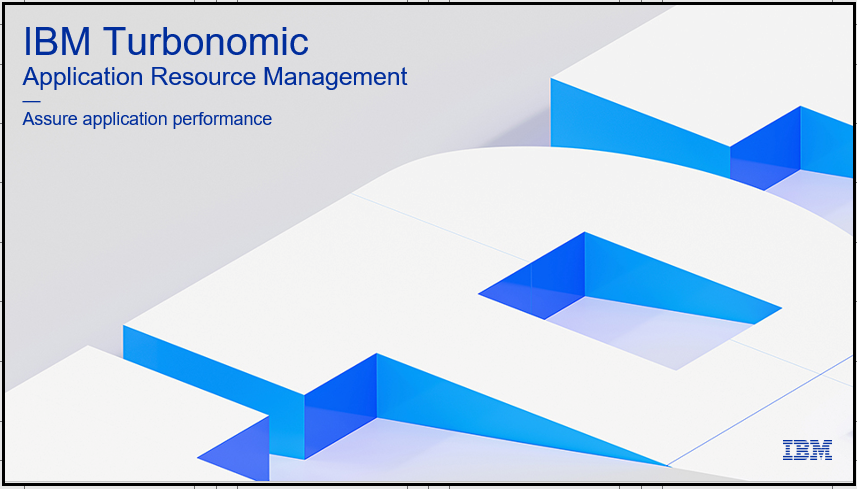

---
export const Title = () => (
  
    Turbonomic Workshop Presentations  
  
);
---
<Row>
<Column colMd={4} colLg={4} noGutterMdLeft>
<ArticleCard
  title="Turbonomic Partner Workshop"
  href="https://ibm.ent.box.com/file/1481203350003?s=yqsn637j0kcetg7cgb5zhf5nqasn9lnv"
  actionIcon="arrowRight"
>

</ArticleCard>
</Column>

</Row>